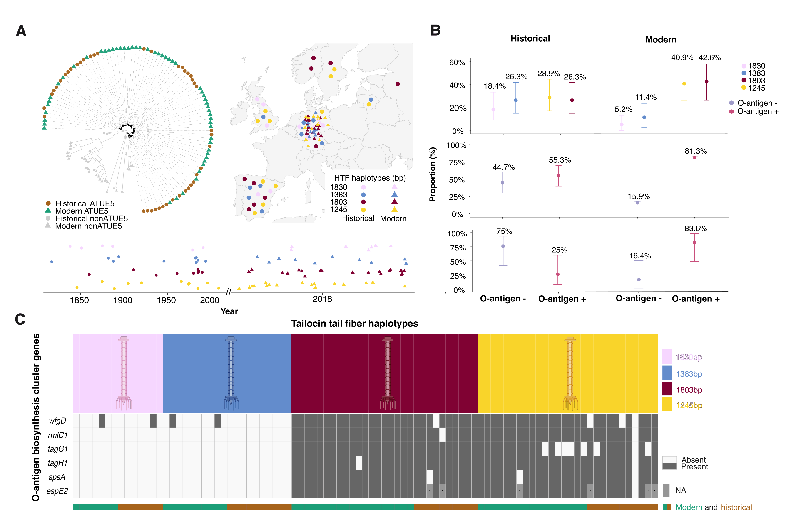

HTF and O-antigen Profiling of ***Pseudomonas viridiflava*** ATUE5 in historical ***Arabidopsis thaliana*** Metagenomes
==================================================================================

This repository contains scripts, data, and results for profiling the hypothetical tail fiber (HTF) haplotypes and O-antigen biosynthesis gene content of ***P. viridiflava*** isolates from historical herbarium and modern ***Arabidopsis thaliana*** samples.

Main Figure
--------------

[samples included](results/step3_combine/mainfig_HTFoantigen_m53_h43_38/m53_h38_heatmap_sixgene_only_with_HTFanno.pdf), 
[samples filtering note](results/step1_HTFhaplotypes/step1.2_HTF_bykmers/step4_additionalanalysis/step2_coinfection/breaking_coninfection)

Analysis pipeline
--------------
[**Data Preprocessing**](scripts/step0_datapreprocessing_tailocin_presence/readme.md)
 
- Extract ATUE5-mapped reads from historical plant herbarium metagenomes
- Authenticate historical DNA damage patterns
- Historical ATUE5 phlogeny reconstruction
- Identify the presence of tailocin region in historical ATUE5 genomes

**HTF Haplotype Assignment**:

- [Local Assembly Approach](scripts/step1_HTFhaplotypes/step1.1_HTF_bylocalassembly/readme.md):
    - Extract reads mapping to HTF/TFA regions
    - Assemble with SPAdes (skip for modern samples, since we have modern assemblies)
    - Assign best haplotype based on covered proportion (minimap2)
- [K-mer Based Approach](scripts/step1_HTFhaplotypes/step1.2_HTF_bykmers_wholegenomeuniquekmers/readme.md):
    - Build whole-genome-exclusive HTF-unique kmers
    - Apply iterative Hamming ≥ 2 filtering across haplotypes
    - Query isolate .jf files (Jellyfish)
    - Assign dominant haplotype by max (HTF matched kmers/total matched kmers) proportion
    - Detect coinfections if multiple haplotypes exceed threshold
    - HTF length group frequency distribution

[**O-antigen Gene P/A Detection**](scripts/step2_Oantigengenes/readme.md):

- A gene is considered present if:
    (i) coverage ≥ 65%
    (ii) Mean depth ≥ mean depth - 0.25*sd of the isolate’s genome-wide average
  
- espE4 handled separately via extended mapping and contig rescue

[**Combined Analysis**](scripts/step3_combine/readme.md):

- Merge HTF and OBC profiles
- Output metadata tables and combined heatmaps

Large data including raw fastq, fasta, reference and so on are stored on Zenodo. Link: 

[Directory Structure](structure.txt)
-------------------
data/

    - modern57.txt, historical*.txt: lists of modern/historical samples.
    - readme.txt: description of input formats.

scripts/

    - step0_datapreprocessing_tailocin_presence/: extract ATUE5-mapped reads from historical plant herbarium metagenomes, historical DNA authentication, ATUE5 phylogeny reconstruction and identify tailocin regions in ATUE5 genomes
    - step1_HTFhaplotypes/: HTF haplotype detection
        - step1.1_HTF_bylocalassembly/: local assembly and mapping-based assignment
        - step1.2_HTF_bykmers_wholegenomeuniquekmers/: kmer filtering, querying, and assignment
    - step2_Oantigengenes/: detection of six O-antigen genes P/A including espE2 rescue
    - step3_combine/: integration of HTF and O-antigen data, generation of summary and plots

results/

    - figureandtable/: Contains all figures and tables used in the manuscript and all analyses
    - step0_datapreprocessing_tailocin_presence/: h40 metadata, historical DNA authentication and summary table of tailocin presence in ATUE5 genomes
    - step1_HTFhaplotypes/: HTF haplotype results (assembly/kmer-based)
    - step2_Oantigengenes/: binary P/A gene matrix and espE2 analysis
    - step3_combine/: combined tables and plots (for manuscript figures)

